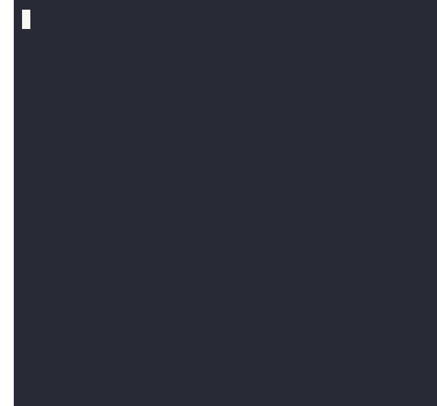

<div align="center">
	<br>
	
	
	<br>
	<br>


</div>

<hr><br>



**The fastest and smallest date manipulation library.**

- **Tiny**: Gzips to less than 1 kilobyte, comparable to the size of only [date-fns](https://github.com/date-fns/date-fns)'s `add` function. That's ~3x smaller than [dayjs](https://github.com/iamkun/dayjs) and ~22x smaller than [luxon](https://github.com/moment/luxon)!
- **Simple**: Only includes necessary functions for manipulation and formatting, excluding excess like equality comparisons.
- **Absurdly fast**: Significantly faster at nearly every single common action than any other similar package.
- **I18N**: Implements [`Intl.DateTimeFormat`](https://developer.mozilla.org/en-US/docs/Web/JavaScript/Reference/Global_Objects/Intl/DateTimeFormat) to translate language-specific terms via the browser.

<br clear="right">

## Installation

To install, use your preferred package manager to download `chronosis`.

```sh
npm install chronosis
```

<details>
	<summary>For contributors</summary>

`chronosis` is developed on Linux, using [bun.sh](https://github.com/oven-sh/bun) as package manager, script runner, bundler, and test runner. Certain parts of the project _may_ work on Windows, but it is highly suggested to [install WSL](https://learn.microsoft.com/en-us/windows/wsl/install) and continue from there.

</details>

Once complete, just import the `Chronosis` class into your code, and start programming!

```ts

```

## Examples

### Format a date to plain text

```ts
// Will return 'June 12, 2023 (12 pm)'
new Chronosis(new Date(2023, 5, 12, 11)).format('MMMM D, YYYY (H a)')
```

### Find how many days are left in the month

```ts
const now = new Chronosis()
const end_of_month = now.clone().endOf('month')

const days_left = end_of_month.get('day') - now.get('day')
```

<!-- TODO: Add more examples -->

## Contributing

Please see [CONTRIBUTING.md](./CONTRIBUTING.md) to see how best to contribute to this project.
